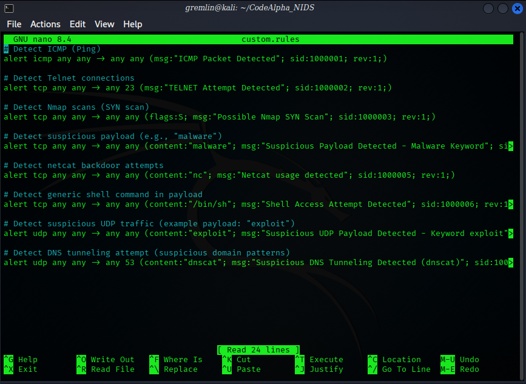
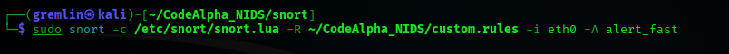
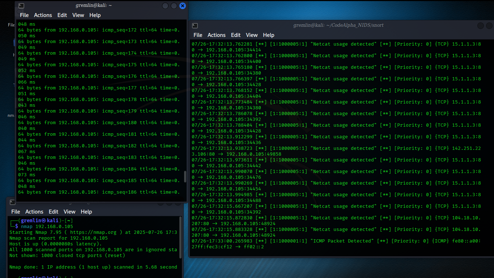

<<<<<<< HEAD
## 🛡️Network Intrusion Detection System (NIDS)
This project is submitted as part of CodeAlpha Cybersecurity Internship Task 4. It demonstrates the setup and configuration of a network-based intrusion detection system using Snort on Kali Linux to monitor and detect suspicious/malicious activities on a network.

## 🔍 Project Objectives
Install and configure Snort on Kali Linux.

Create and apply custom rules to detect malicious traffic.

Monitor a specific network interface (eth0).

Generate alerts when suspicious activity is detected.

Visualize attack logs using alert output.

## 🖥️ Platform Used
OS: Kali Linux (main)

Tool: Snort++ v3.1.82.0

Network Interface: eth0

Files: custom.rules (for alerts), Snort configuration (snort.lua)

## ⚙️ Installation & Setup (Kali Linux)

1. First, make sure your system is updated:

sudo apt update && sudo apt upgrade -y

2. Install Snort:

sudo apt install snort -y

3. Check installed version:

snort -V

4. Navigate to your working directory (e.g., CodeAlpha_NIDS):

cd ~/CodeAlpha_NIDS

5. Create custom.rules file and write detection rules inside.

## Run Snort with:

sudo snort -c /etc/snort/snort.lua -R ./custom.rules -i eth0 -A alert_fast

## 💻 Windows Support (Optional)
If you want to run this project in Windows:

1. Install Npcap:

https://npcap.com/#download

2. Install Snort for Windows:

https://www.snort.org/downloads

Place the same custom.rules file in Snort’s rules directory.

## Run from cmd (replace interface name accordingly):

snort.exe -c snort.lua -R custom.rules -i 1 -A alert_fast

⚠ Note: Kali is preferred for easier configuration and better output in terminal.

## 📜 Detection Rules Included:

ICMP (Ping) detection

Telnet connection attempt

Nmap SYN scan

Suspicious payload (e.g., "malware")

Netcat usage detection

Shell command access (/bin/sh)

## 📸Output

| Detection: ICMP & Netcat Usage Attempt |

=======
# CodeAlpha_Network-Intrusion-Detection-System_NIDS
Network Intrusion Detection System built with Snort
>>>>>>> 327e947ec5c7bb1e383866a2cb8159c1c62b693b
